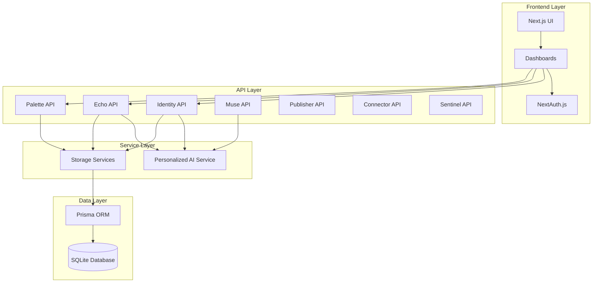
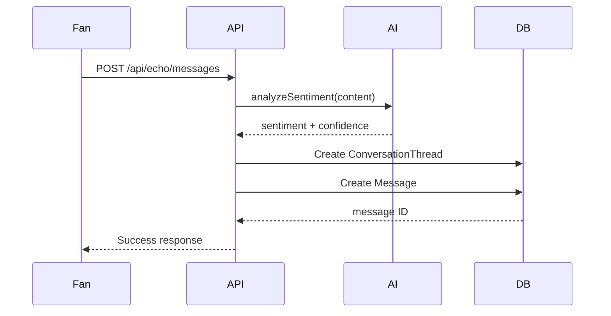
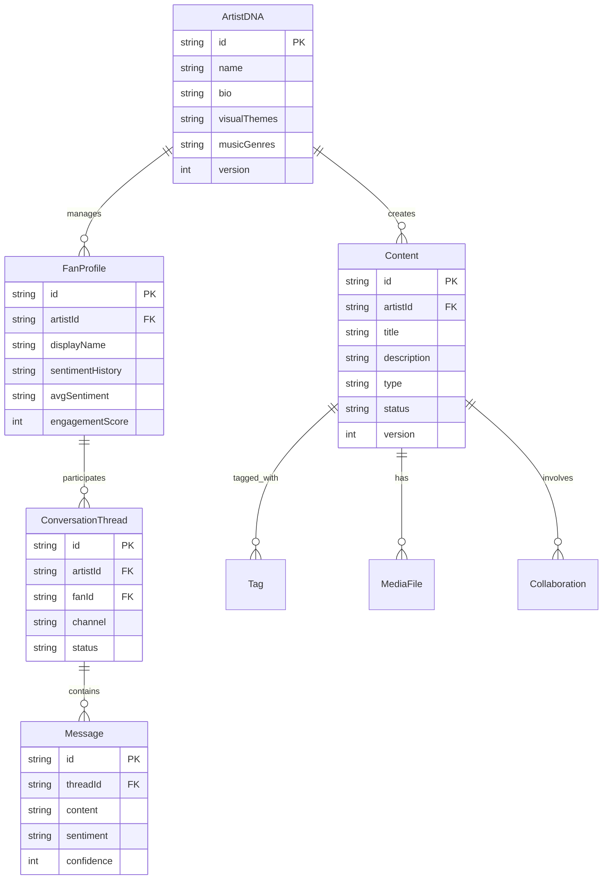
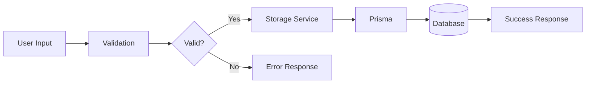
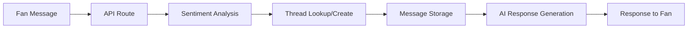

# Neural Palette Architecture

**Version**: 1.0.0
**Last Updated**: 2025-10-22
**Project**: AI-Powered Artist Identity & Content Management Platform

## 📊 Project Statistics

- **Total TypeScript Files**: 76
- **Lines of Code**: 64,558
- **Test Coverage**: 100% (94/94 tests passing)
- **TypeScript Strict Mode**: Enabled
- **Database**: SQLite (Prisma ORM)
- **Framework**: Next.js 14.2.33

## 🏗️ System Architecture

### High-Level Overview



## 🎯 Core Components

### 1. Neural Identity (Artist DNA)

**Purpose**: Manage artist identity and personality configuration.

**Key Features**:
- Artist DNA creation and management
- Visual themes and music genres
- Writing style and tone configuration
- Core values and artistic vision

**API Endpoints**:
- `GET /api/identity` - Retrieve artist DNA
- `POST /api/identity` - Create artist DNA
- `PATCH /api/identity/:id` - Update artist DNA

**Database Schema**:
```prisma
model ArtistDNA {
  id                        String   @id @default(uuid())
  name                      String
  bio                       String
  visualThemes              String   // JSON array
  musicGenres               String   // JSON array
  writingStyle              String
  colorPalette              String   // JSON array
  tone                      String
  emojiUsage                EmojiUsage
  responseLength            ResponseLength
  languagePreferences       String   // JSON array
  coreValues                String   // JSON array
  artisticVision            String
  fanRelationshipPhilosophy String
  version                   Int
  createdAt                 DateTime @default(now())
  updatedAt                 DateTime @updatedAt
}
```

### 2. Neural Echo (Fan Engagement)

**Purpose**: AI-powered fan message analysis and response.

**Key Features**:
- Sentiment analysis
- Conversation threading
- Personalized AI responses
- Engagement tracking

**API Endpoints**:
- `GET /api/echo/messages` - List messages
- `POST /api/echo/messages` - Create message
- `GET /api/echo/stats` - Get statistics

**Data Flow**:


### 3. Neural Palette (Content Management)

**Purpose**: Manage artistic content and creative works.

**Key Features**:
- Content CRUD operations
- Search and filtering
- Version management
- Media file associations

**API Endpoints**:
- `GET /api/palette/content` - List content
- `POST /api/palette/content` - Create content
- `GET /api/palette/content/:id` - Get content
- `PATCH /api/palette/content/:id` - Update content
- `DELETE /api/palette/content/:id` - Delete content

### 4. Neural Muse (AI Content Generation)

**Purpose**: AI-powered content generation and creative assistance.

**Key Features**:
- Text generation based on artist DNA
- Style consistency
- Tone matching
- Language preferences

**API Endpoints**:
- `POST /api/muse/generate` - Generate content

### 5. Neural Publisher (Content Distribution)

**Purpose**: Content publishing and distribution management.

**API Endpoints**:
- `GET /api/publisher/stats` - Publishing statistics

### 6. Neural Connector (Platform Integration)

**Purpose**: External platform integration and synchronization.

**API Endpoints**:
- `GET /api/connector/stats` - Integration statistics

### 7. Neural Sentinel (Content Monitoring)

**Purpose**: Content monitoring and moderation.

**API Endpoints**:
- `GET /api/sentinel/stats` - Monitoring statistics

## 🗄️ Database Schema

### Core Models



## 🔐 Authentication & Authorization

### NextAuth.js Configuration

```typescript
// app/api/auth/[...nextauth]/route.ts
export const authOptions: NextAuthOptions = {
  providers: [
    CredentialsProvider({
      name: 'Credentials',
      credentials: {
        username: { label: "Username", type: "text" },
        password: { label: "Password", type: "password" }
      },
      async authorize(credentials) {
        // Authentication logic
      }
    })
  ],
  pages: {
    signIn: '/auth/signin',
  },
  session: {
    strategy: 'jwt'
  }
}
```

## 🧪 Testing Strategy

### Test Coverage

| Category | Tests | Status |
|----------|-------|--------|
| Unit Tests | 79 | ✅ 100% |
| E2E Tests | 15 | ✅ 100% |
| **Total** | **94** | **✅ 100%** |

### Test Structure

```
src/
├── __tests__/               # Unit tests
│   ├── api/                 # API tests
│   ├── storage/             # Storage tests
│   └── validation/          # Validation tests
e2e/
├── api.spec.ts              # API E2E tests
├── dashboards.spec.ts       # Dashboard E2E tests
└── global-setup.ts          # E2E test setup
```

### E2E Test Setup

```typescript
// e2e/global-setup.ts
async function globalSetup() {
  const prisma = new PrismaClient()

  // Clean existing data
  await prisma.message.deleteMany({})
  await prisma.conversationThread.deleteMany({})
  await prisma.fanProfile.deleteMany({})
  await prisma.content.deleteMany({})
  await prisma.artistDNA.deleteMany({})

  // Seed test data
  const artist = await prisma.artistDNA.create({ data: { ... } })
  await prisma.fanProfile.create({ data: { id: 'anonymous', ... } })
  await prisma.content.create({ data: { ... } })
}
```

## 🔄 Data Flow Patterns

### 1. Content Creation Flow



### 2. AI-Powered Message Flow



## 🚀 Deployment Architecture

### Development Environment

```
Local Machine
├── Next.js Dev Server (localhost:3000)
├── SQLite Database (file:./dev.db)
└── Node.js 20.x
```

### Production Environment (Target)

```
Cloud Platform (Firebase/Vercel)
├── Next.js SSR/SSG
├── PostgreSQL/SQLite
├── CDN for static assets
└── Environment Variables
```

## 📝 API Design Patterns

### RESTful Endpoints

```
/api/identity          # Artist DNA management
/api/echo/*            # Fan engagement
/api/palette/*         # Content management
/api/muse/*            # AI generation
/api/publisher/*       # Publishing
/api/connector/*       # Integration
/api/sentinel/*        # Monitoring
```

### Response Format

```typescript
// Success Response
{
  success: true,
  data: { ... },
  message?: string
}

// Error Response
{
  success: false,
  error: string,
  details?: any
}
```

## 🔧 Technology Stack

### Frontend
- **Framework**: Next.js 14.2.33
- **UI**: React 18.3.1
- **Styling**: Tailwind CSS 3.4.1
- **Auth**: NextAuth.js 4.24.11

### Backend
- **Runtime**: Node.js 20.x
- **Language**: TypeScript 5.x (Strict Mode)
- **ORM**: Prisma 6.17.1
- **Database**: SQLite (Dev), PostgreSQL-ready

### Testing
- **Unit**: Vitest 3.2.4
- **E2E**: Playwright
- **Coverage**: 100%

### Development Tools
- **Linter**: ESLint
- **Formatter**: Prettier
- **Type Checking**: tsc --noEmit

## 📈 Performance Considerations

### Database Optimization
- Indexed fields: `id`, `artistId`, `fanId`
- Query optimization with Prisma
- Connection pooling

### Caching Strategy
- API response caching
- Static page generation (SSG)
- Incremental Static Regeneration (ISR)

### Code Splitting
- Dynamic imports for heavy components
- Route-based code splitting
- Tree shaking optimization

## 🔒 Security Measures

### Input Validation
- Zod schemas for all inputs
- Type-safe API routes
- SQL injection prevention (Prisma)

### Authentication
- JWT-based sessions
- Secure password hashing
- CSRF protection

### Data Protection
- Environment variable encryption
- API key rotation
- HTTPS-only in production

## 📚 Related Documentation

- [VERIFICATION_REPORT.md](../VERIFICATION_REPORT.md) - System health check
- [README.md](../README.md) - Project overview
- [Prisma Schema](../prisma/schema.prisma) - Database schema

---

🌸 Generated by Miyabi Water Spider
📅 Last Updated: 2025-10-22
🤖 Powered by Claude Code
